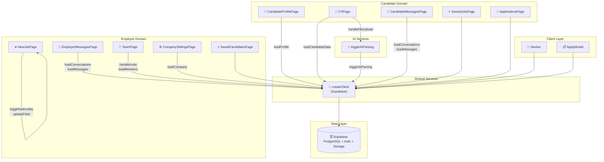
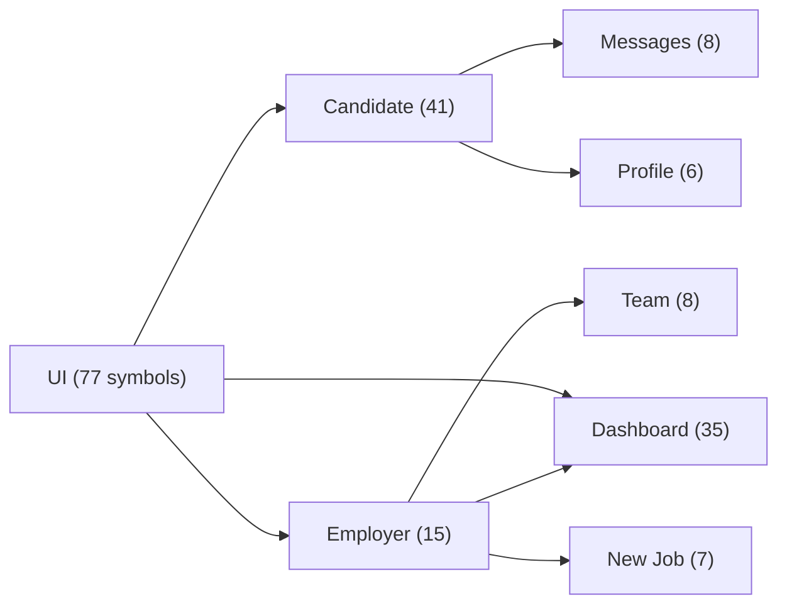

# Architecture — NEW CV JOBS (GrowthNexus)

> Auto-generated from GitNexus knowledge graph.
> **1,460 symbols · 2,232 relationships · 33 clusters · 13 execution flows**

---

## Overview

GrowthNexus is a **two-sided recruitment platform** built with **Next.js (App Router)** and **Supabase**. It connects **Candidates** (job-seekers who upload CVs, browse jobs, and apply) with **Employers** (companies that post jobs, manage teams, and review applications). A shared **messaging system** connects both sides. All data access goes through a centralized Supabase client utility.

### Tech Stack

| Layer | Technology |
|-------|-----------|
| Framework | Next.js 14+ (App Router) |
| Language | TypeScript / React |
| Database & Auth | Supabase (PostgreSQL + Auth + Storage) |
| Data Access | `createClient()` — single Supabase client factory |
| Styling | CSS / Component-level styles |

---

## Functional Areas (Clusters)

The knowledge graph detected **8 primary functional areas** ranked by symbol count and internal cohesion:

| Module | Symbols | Cohesion | Description |
|--------|---------|----------|-------------|
| **UI** | 77 | 95% | Shared components — Navbar, modals, forms, layout primitives |
| **Candidate** | 41 | 85% | Job-seeker flows — CV upload, profile, job search, applications |
| **Dashboard** | 35 | 96% | Employer dashboard — job listings, candidate review, analytics |
| **Employer** | 15 | 89% | Company management — settings, team, job posting |
| **Team** | 8 | 83% | Team/member management — invites, roles, permissions |
| **Messages** | 8 | 73% | Real-time messaging between candidates and employers |
| **New** | 7 | 95% | Job creation wizard — multi-step form with field management |
| **Profile** | 6 | 91% | User profile management — candidate and employer profiles |

---

## Key Execution Flows

All 13 traced execution flows in the system. Cross-community flows span multiple functional areas; intra-community flows stay within one.

### Cross-Community Flows (Span Multiple Modules)

#### 1. Employer Messaging
```
EmployerMessagesPage → loadConversations → loadMessages → createClient
```
- **Entry**: `employer/messages/page.tsx`
- **Terminal**: `utils/supabase/client.ts`
- Loads employer's conversation list, then fetches messages for selected conversation.

#### 2. Candidate Messaging
```
CandidateMessagesPage → loadConversations → loadMessages → createClient
```
- **Entry**: `candidate/messages/page.tsx`
- **Terminal**: `utils/supabase/client.ts`
- Mirror of employer messaging — same pattern, different user role.

#### 3. CV Upload & AI Parsing
```
handleFileUpload → triggerAIParsing → loadCandidateData → createClient
```
- **Entry**: `candidate/cv/page.tsx`
- **Terminal**: `utils/supabase/client.ts`
- Uploads CV file, triggers AI-powered parsing/extraction, then reloads candidate data.

#### 4. Candidate Profile
```
CandidateProfilePage → loadProfile → createClient
```
- **Entry**: `candidate/profile/page.tsx`
- **Terminal**: `utils/supabase/client.ts`

#### 5. CV Page Data Load
```
CVPage → loadCandidateData → createClient
```
- **Entry**: `candidate/cv/page.tsx`
- **Terminal**: `utils/supabase/client.ts`

### Intra-Community Flows (Single Module)

#### 6. Job Creation
```
NewJobPage → toggleNationality → updateField
```
- **Entry/Terminal**: `employer/jobs/new/page.tsx`
- Multi-step job posting form with dynamic field updates.

#### 7. Company Settings
```
CompanySettingsPage → loadCompany → createClient
```
- **Entry**: `employer/settings/page.tsx`

#### 8. Team Management
```
TeamPage → handleInvite → loadMembers
```
- **Entry**: `employer/team/page.tsx`
- Manages team invitations and loads current member list.

#### 9–13. Additional Flows
| Flow | Entry Point | Steps |
|------|------------|-------|
| SavedCandidatesPage → CreateClient | `employer/saved/page.tsx` | 3 |
| SavedJobsPage → CreateClient | `candidate/saved/page.tsx` | 3 |
| Navbar → CreateClient | Shared UI component | 3 |
| ApplyModal → CreateClient | Shared UI component | 3 |
| ApplicationsPage → CreateClient | `candidate/applications/page.tsx` | 3 |

---

## Architecture Diagram



---

## Data Access Pattern

All pages follow a **centralized client pattern**: every page that touches data calls `createClient()` from `growth-nexus/src/utils/supabase/client.ts`. This is the **single gateway** to the Supabase backend.

```
Page Component → load*() / handle*() → createClient() → Supabase
```

This means:
- **Changing `createClient()`** has a **CRITICAL blast radius** — it affects all 13 execution flows.
- **Changing a page's load function** only affects that page's flow.
- **Messages** are the most complex flows (4 steps: page → loadConversations → loadMessages → client).

---

## Module Dependency Map



---

## Key Architectural Observations

1. **Supabase is the single point of failure** — `createClient()` is the terminal node for 12 of 13 flows.
2. **Symmetric messaging** — Employer and Candidate messaging flows are identical in structure, suggesting a shared abstraction opportunity.
3. **AI integration is minimal** — only the CV upload flow uses AI (`triggerAIParsing`), isolated to one page.
4. **High UI cohesion (95%)** — shared components are well-structured and reusable.
5. **Messages module has lowest cohesion (73%)** — may benefit from refactoring to reduce cross-boundary dependencies.
6. **Job creation is self-contained** — the NewJobPage flow stays entirely within its own module (intra-community).

---

*Generated from GitNexus knowledge graph · 1,460 nodes · 2,232 edges · 33 clusters · 13 flows*
