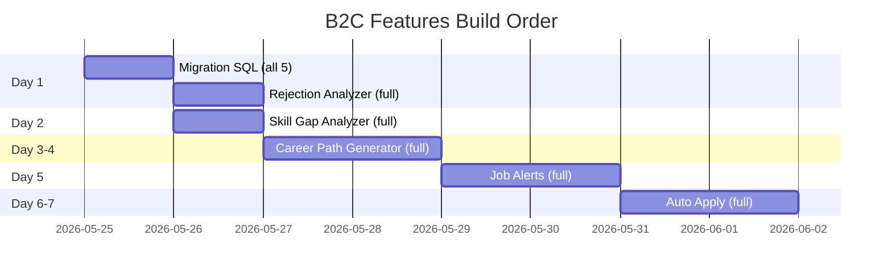

# 📋 GrowthNexus — B2C Features Implementation Plan

> **Created:** 24 May 2026
> **Status:** Ready for implementation
> **Prerequisite Pattern:** Interview Practice (done 14 May) — all 5 features follow the same architecture
> **Effort Estimate:** ~5-8 days for all 5 features

---

## 🏗️ Architecture Pattern (from existing code analysis)

Every B2C feature follows this **exact pattern** (proven in Interview Practice):

```
┌─────────────────────────────────────────────────────────────────┐
│              ARCHITECTURE PATTERN (2 types)                     │
├─────────────────────────────────────────────────────────────────┤
│                                                                 │
│  TYPE A: AI Analysis (Features 1-3)                            │
│  1. SQL Migration → table + RLS + credit RPC + system_config   │
│  2. API Route    → /api/{feature} (auth + credits + n8n proxy) │
│  3. n8n Workflow → Webhook → Gemini → Parse → Respond          │
│  4. Frontend     → /candidate/{feature}/page.tsx               │
│  5. Sidebar      → Add link to candidate/layout.tsx            │
│                                                                 │
│  TYPE B: n8n-Native Automation (Features 4-5)                  │
│  1. SQL Migration → table + RLS + system_config                │
│  2. API Route    → /api/{feature} (CRUD only — save prefs)     │
│  3. n8n Workflow → Schedule Trigger → Supabase Query →         │
│                    Match Logic → Supabase Write → SMTP Email   │
│  4. Frontend     → /candidate/{feature}/page.tsx               │
│  5. Sidebar      → Add link to candidate/layout.tsx            │
│  ⚠️ NO API cron route — n8n Schedule Trigger handles it all    │
│                                                                 │
└─────────────────────────────────────────────────────────────────┘
```

### Reusable Components Already Built:
| Component | Location | Reuse For |
|-----------|----------|-----------|
| `SearchableSelect` | `interview-practice/page.tsx:59-158` | Career Path, Skill Gap (job/industry selectors) |
| `deduct_interview_credits()` RPC | `20260514000000_interview_practice.sql:48-84` | Clone → `deduct_b2c_credits()` |
| Credit banner UI | `interview-practice/page.tsx:321-339` | All 5 features |
| Session history pattern | `interview-practice/page.tsx:407-456` | Rejection, Career, Skill Gap |
| n8n webhook proxy pattern | `/api/interview/practice/route.ts` | All features |

### Integration Points (from codebase analysis):
| Touch Point | File | What Changes |
|------------|------|-------------|
| Sidebar nav | `candidate/layout.tsx:23-33` | Add 5 new links to `sidebarLinks[]` |
| Types | `lib/types.ts` | Add new interfaces |
| Applications data | `applications` table | rejection_reason, interview_score, ai_match_score already exist |
| Candidate skills | `candidates.skills[]` | Used for Skill Gap comparison |
| Jobs data | `jobs.skills_required[]` | Target skills for matching |
| system_config | `system_config` table | Add free_mode + cost toggles per feature |

---

## 📁 File Manifest (ALL new files)

```
growth-nexus/
├── supabase/migrations/
│   └── 20260524000000_b2c_services.sql              ← Single migration for all 5
│
├── src/app/api/
│   ├── ai/
│   │   ├── rejection-analysis/route.ts               ← #1 Rejection Analyzer (n8n proxy)
│   │   ├── career-path/route.ts                      ← #2 Career Path (n8n proxy)
│   │   └── skill-gap/route.ts                        ← #3 Skill Gap (n8n proxy)
│   ├── job-alerts/
│   │   └── route.ts                                  ← #4 CRUD only (n8n does matching)
│   └── auto-apply/
│       └── route.ts                                  ← #5 CRUD only (n8n does matching)
│
├── src/app/candidate/
│   ├── rejection-analyzer/page.tsx                   ← #1 Frontend
│   ├── career-path/page.tsx                          ← #2 Frontend
│   ├── skill-gap/page.tsx                            ← #3 Frontend
│   ├── job-alerts/page.tsx                           ← #4 Frontend
│   └── auto-apply/page.tsx                           ← #5 Frontend
│
├── n8n-job-alerts-workflow.json                       ← #4 n8n workflow (import to n8n)
├── n8n-auto-apply-workflow.json                      ← #5 n8n workflow (import to n8n)
│
└── src/lib/types.ts                                  ← Add 5 new interfaces
```

---

## Feature 1: Rejection Analyzer (29 AED one-time)

> **Priority:** 🔴 HIGH — Directly monetizes existing rejected applications
> **Effort:** ~1 day
> **Revenue:** Per-analysis credit charge

### Why it's easy:
- Data already exists: `applications.status = 'rejected'`, `applications.rejection_reason`, `applications.interview_score`
- Job data available: `jobs.skills_required`, `jobs.title`, job description
- Candidate data available: `candidates.skills`, `candidates.years_experience`
- Pattern identical to Interview Practice

### Database

```sql
-- In 20260524000000_b2c_services.sql

-- Rejection analysis results (stored on the application)
ALTER TABLE public.applications 
ADD COLUMN IF NOT EXISTS rejection_analysis JSONB DEFAULT NULL;

-- System config
INSERT INTO system_config (key, value, description) VALUES
    ('rejection_analyzer_free_mode', 'true', 'Skip credit check (testing)'),
    ('rejection_analyzer_cost', '1', 'Credits per analysis')
ON CONFLICT (key) DO NOTHING;
```

> No new table needed — save analysis result as JSONB on the existing `applications` row.

### API: `/api/ai/rejection-analysis/route.ts`

```
POST { application_id }
  1. Auth check (supabase.auth.getUser)
  2. Load application (status must be 'rejected')
  3. Load job (title, skills_required, description)
  4. Load candidate (skills, experience, education from resume_parsed_data)
  5. Credit check (deduct_b2c_credits)
  6. Send to n8n webhook OR direct Gemini call
  7. Save result to applications.rejection_analysis
  8. Return analysis JSON
```

### n8n Workflow: `gn-rejection-analyze`

```
Webhook (application_id, job data, candidate data)
  → Gemini Prompt: "لماذا تم رفض هذا المرشح؟ حلل بناءً على..."
  → Parse JSON
  → Respond {
      likely_reasons: string[],
      improvement_areas: string[],
      missing_skills: string[],
      recommended_actions: string[],
      alternative_roles: string[],
      score_comparison: { candidate_score, job_requirements }
    }
```

### Frontend: `/candidate/rejection-analyzer/page.tsx`

```
Phase 1: LIST — show all rejected applications (from /api/...)
  - Card per rejected app: job title, company, rejection reason, date
  - "تحليل الرفض" button (gold CTA)
  
Phase 2: RESULT — analysis display
  - 🔴 أسباب الرفض المحتملة (red cards)
  - 🟡 مجالات التحسين (amber cards)  
  - 🟢 مهارات مطلوبة (green skill badges)
  - 📋 خطوات عملية (numbered action items)
  - 💼 وظائف بديلة مقترحة (job suggestions)
```

### Sidebar Link
```ts
// In candidate/layout.tsx → sidebarLinks[]
{ href: '/candidate/rejection-analyzer', label: 'تحليل الرفض', icon: AlertTriangle },
```

---

## Feature 2: Career Path Generator (29 AED/month)

> **Priority:** 🟡 MEDIUM — Recurring revenue, high perceived value
> **Effort:** ~1.5 days
> **Revenue:** Monthly subscription

### Database

```sql
-- Career path sessions
CREATE TABLE IF NOT EXISTS public.career_path_sessions (
    id UUID PRIMARY KEY DEFAULT gen_random_uuid(),
    user_id UUID NOT NULL REFERENCES auth.users(id) ON DELETE CASCADE,
    current_role TEXT NOT NULL,
    target_role TEXT,
    industry TEXT NOT NULL,
    years_experience INTEGER DEFAULT 0,
    current_skills TEXT[] DEFAULT '{}',
    result JSONB,
    status TEXT DEFAULT 'pending' CHECK (status IN ('pending', 'completed', 'failed')),
    created_at TIMESTAMPTZ DEFAULT now()
);

ALTER TABLE public.career_path_sessions ENABLE ROW LEVEL SECURITY;

CREATE POLICY "Users can view own career paths"
    ON public.career_path_sessions FOR SELECT USING (auth.uid() = user_id);
CREATE POLICY "Users can insert own career paths"
    ON public.career_path_sessions FOR INSERT WITH CHECK (auth.uid() = user_id);
CREATE POLICY "Users can update own career paths"
    ON public.career_path_sessions FOR UPDATE USING (auth.uid() = user_id);
CREATE POLICY "Users can delete own career paths"
    ON public.career_path_sessions FOR DELETE USING (auth.uid() = user_id);

CREATE INDEX IF NOT EXISTS idx_career_path_user
    ON public.career_path_sessions(user_id, created_at DESC);

-- System config
INSERT INTO system_config (key, value, description) VALUES
    ('career_path_free_mode', 'true', 'Skip credit check (testing)'),
    ('career_path_cost', '1', 'Credits per career path generation')
ON CONFLICT (key) DO NOTHING;
```

### API: `/api/ai/career-path/route.ts`

```
POST { current_role, target_role, industry, years_experience }
  1. Auth + credit check
  2. Load candidate profile (skills from candidates table)
  3. Create career_path_sessions row (status: pending)
  4. Send to n8n → Gemini
  5. Save result, set status: completed
  6. Return career path JSON
```

### n8n Workflow: `gn-career-path`

```
Webhook → Gemini Prompt → Parse → Respond {
  current_assessment: { level, strengths[], gaps[] },
  career_path: [
    { year: 1, role, skills_to_learn[], certifications[], salary_range },
    { year: 2, role, skills_to_learn[], certifications[], salary_range },
    { year: 3, role, skills_to_learn[], certifications[], salary_range },
    { year: 5, role, skills_to_learn[], certifications[], salary_range }
  ],
  training_recommendations: [
    { name, provider, cost, duration, priority }
  ],
  market_insights: { demand_level, growth_rate, avg_salary_uae }
}
```

### Frontend: `/candidate/career-path/page.tsx`

```
Phase 1: SETUP
  - Current role (SearchableSelect — reuse from interview-practice)
  - Target role (optional — AI suggests if empty)
  - Industry (SearchableSelect — reuse)
  - Years of experience (number input)
  - Credits banner (reuse pattern)
  
Phase 2: RESULT  
  - Visual timeline (vertical steps with years)
  - Skill gap badges (🟢 have / 🔴 need)
  - Training cards (name, provider, cost, duration)
  - Salary progression chart (simple bar)
  - Market demand badge

Phase 3: HISTORY
  - Session history table (reuse pattern from interview-practice)
```

### Sidebar Link
```ts
{ href: '/candidate/career-path', label: 'المسار المهني', icon: TrendingUp },
```

---

## Feature 3: Skill Gap Analyzer (25 AED one-time)

> **Priority:** 🟡 MEDIUM — Complements Career Path
> **Effort:** ~1 day
> **Revenue:** Per-analysis credit charge

### Database

```sql
-- Skill gap analyses
CREATE TABLE IF NOT EXISTS public.skill_gap_analyses (
    id UUID PRIMARY KEY DEFAULT gen_random_uuid(),
    user_id UUID NOT NULL REFERENCES auth.users(id) ON DELETE CASCADE,
    target_job_title TEXT NOT NULL,
    target_skills TEXT[] DEFAULT '{}',
    candidate_skills TEXT[] DEFAULT '{}',
    result JSONB,
    status TEXT DEFAULT 'pending' CHECK (status IN ('pending', 'completed', 'failed')),
    created_at TIMESTAMPTZ DEFAULT now()
);

ALTER TABLE public.skill_gap_analyses ENABLE ROW LEVEL SECURITY;

CREATE POLICY "Users can view own skill gaps"
    ON public.skill_gap_analyses FOR SELECT USING (auth.uid() = user_id);
CREATE POLICY "Users can insert own skill gaps"
    ON public.skill_gap_analyses FOR INSERT WITH CHECK (auth.uid() = user_id);
CREATE POLICY "Users can update own skill gaps"
    ON public.skill_gap_analyses FOR UPDATE USING (auth.uid() = user_id);
CREATE POLICY "Users can delete own skill gaps"
    ON public.skill_gap_analyses FOR DELETE USING (auth.uid() = user_id);

CREATE INDEX IF NOT EXISTS idx_skill_gap_user
    ON public.skill_gap_analyses(user_id, created_at DESC);

-- System config
INSERT INTO system_config (key, value, description) VALUES
    ('skill_gap_free_mode', 'true', 'Skip credit check (testing)'),
    ('skill_gap_cost', '1', 'Credits per analysis')
ON CONFLICT (key) DO NOTHING;
```

### API: `/api/ai/skill-gap/route.ts`

```
POST { target_job_id OR target_job_title, target_skills[] }
  1. Auth + credit check
  2. Load candidate skills (from candidates.skills[])
  3. If target_job_id → load job.skills_required[]
  4. If not → use provided target_skills[]
  5. Create skill_gap_analyses row
  6. Send to n8n → Gemini (candidate_skills vs target_skills)
  7. Save result
  8. Return gap analysis
```

### n8n Workflow: `gn-skill-gap`

```
Webhook → Gemini → Parse → Respond {
  match_percentage: number,
  matched_skills: [{ skill, level: "strong"|"basic" }],
  missing_skills: [{ skill, priority: "critical"|"important"|"nice_to_have", 
                     learning_time: "1 شهر", resources[] }],
  transferable_skills: [{ from_skill, applicable_to, relevance }],
  action_plan: [
    { priority: 1, skill, action, timeline, resource }
  ]
}
```

### Frontend: `/candidate/skill-gap/page.tsx`

```
Phase 1: SETUP
  - Option A: Select from active jobs on platform (load jobs with skills_required)
  - Option B: Enter target job title + skills manually
  - Auto-load candidate's current skills from profile
  - Credits banner

Phase 2: RESULT
  - Match percentage circle (reuse SmartMatchButton pattern — 🟢≥70 🟡≥40 🔴<40)
  - Two columns: ✅ مهارات متطابقة (green) | ❌ مهارات مطلوبة (red)
  - Priority-ordered learning plan (numbered list)
  - Resource recommendations (links/badges)
  
Phase 3: HISTORY
  - Session history table (reuse pattern)
```

### Sidebar Link
```ts
{ href: '/candidate/skill-gap', label: 'تحليل المهارات', icon: BarChart3 },
```

---

## Feature 4: Smart Job Alert (19 AED/month) — 🔧 FULLY n8n-NATIVE

> **Priority:** 🟡 MEDIUM — Recurring revenue, drives engagement
> **Effort:** ~1.5 days
> **Revenue:** Monthly subscription
> **Architecture:** TYPE B — n8n Schedule Trigger does all matching + emailing. API only saves user preferences.

### Database

```sql
-- Job alert preferences
CREATE TABLE IF NOT EXISTS public.job_alert_preferences (
    id UUID PRIMARY KEY DEFAULT gen_random_uuid(),
    user_id UUID NOT NULL REFERENCES auth.users(id) ON DELETE CASCADE,
    alert_name TEXT DEFAULT 'التنبيه الرئيسي',
    keywords TEXT[] DEFAULT '{}',
    skills TEXT[] DEFAULT '{}',
    job_types TEXT[] DEFAULT '{}',
    locations TEXT[] DEFAULT '{}',
    salary_min INTEGER,
    salary_max INTEGER,
    frequency TEXT DEFAULT 'daily' CHECK (frequency IN ('daily', 'weekly', 'instant')),
    is_active BOOLEAN DEFAULT true,
    last_sent_at TIMESTAMPTZ,
    created_at TIMESTAMPTZ DEFAULT now(),
    updated_at TIMESTAMPTZ DEFAULT now(),
    UNIQUE(user_id, alert_name)
);

ALTER TABLE public.job_alert_preferences ENABLE ROW LEVEL SECURITY;

CREATE POLICY "Users can view own alerts"
    ON public.job_alert_preferences FOR SELECT USING (auth.uid() = user_id);
CREATE POLICY "Users can insert own alerts"
    ON public.job_alert_preferences FOR INSERT WITH CHECK (auth.uid() = user_id);
CREATE POLICY "Users can update own alerts"
    ON public.job_alert_preferences FOR UPDATE USING (auth.uid() = user_id);
CREATE POLICY "Users can delete own alerts"
    ON public.job_alert_preferences FOR DELETE USING (auth.uid() = user_id);

-- Job alert history (what was sent)
CREATE TABLE IF NOT EXISTS public.job_alert_history (
    id UUID PRIMARY KEY DEFAULT gen_random_uuid(),
    user_id UUID NOT NULL REFERENCES auth.users(id) ON DELETE CASCADE,
    preference_id UUID REFERENCES public.job_alert_preferences(id) ON DELETE SET NULL,
    jobs_matched INTEGER DEFAULT 0,
    jobs_sent JSONB DEFAULT '[]',
    sent_at TIMESTAMPTZ DEFAULT now()
);

ALTER TABLE public.job_alert_history ENABLE ROW LEVEL SECURITY;

CREATE POLICY "Users can view own alert history"
    ON public.job_alert_history FOR SELECT USING (auth.uid() = user_id);

CREATE INDEX IF NOT EXISTS idx_job_alert_user
    ON public.job_alert_preferences(user_id, is_active);
CREATE INDEX IF NOT EXISTS idx_job_alert_history_user
    ON public.job_alert_history(user_id, sent_at DESC);

-- System config
INSERT INTO system_config (key, value, description) VALUES
    ('job_alerts_free_mode', 'true', 'Skip subscription check (testing)'),
    ('job_alerts_max_per_user', '3', 'Max alert preferences per user')
ON CONFLICT (key) DO NOTHING;
```

### API: `/api/job-alerts/route.ts` — CRUD ONLY (no cron logic)

```
GET    → list user's alert preferences + recent history
POST   → create new alert preference (validate max limit from system_config)
PATCH  → update alert preference (toggle active, change filters)
DELETE → remove alert preference
```

> ⚠️ **NO `/api/job-alerts/match/route.ts`** — n8n handles everything below.

### n8n Workflow: `gn-job-alerts` — FULLY n8n-NATIVE (12 nodes)

```
┌──────────────────────────────────────────────────────────────────────┐
│                    n8n Job Alerts Workflow                          │
│                    (runs entirely inside n8n)                       │
├──────────────────────────────────────────────────────────────────────┤
│                                                                      │
│  1. Schedule Trigger                                                 │
│     ├─ Daily: 08:00 UAE time (for frequency = 'daily')              │
│     └─ Weekly: Sunday 08:00 UAE (for frequency = 'weekly')          │
│                                                                      │
│  2. Supabase Node: Load Active Preferences                          │
│     SELECT * FROM job_alert_preferences                              │
│     WHERE is_active = true                                           │
│     AND (frequency = 'daily' OR frequency = 'weekly')               │
│                                                                      │
│  3. Loop (SplitInBatches): For Each Preference                      │
│     │                                                                │
│     4. Supabase Node: Query Matching Jobs                            │
│        SELECT * FROM jobs WHERE status = 'active'                    │
│        AND (skills_required && preference.skills                     │
│             OR title ILIKE ANY(preference.keywords))                 │
│        AND location_city = ANY(preference.locations)                 │
│        AND created_at > preference.last_sent_at                     │
│                                                                      │
│     5. IF Node: Has Matches?                                         │
│        ├─ YES →                                                      │
│        │  6. Supabase Node: Load User Profile (email, name)          │
│        │  7. Code Node: Build Email HTML                             │
│        │     - Arabic email template                                 │
│        │     - List of matching jobs with title, company, salary     │
│        │     - CTA link: "عرض الوظيفة" → jobs-test.uae4jobs.ae/jobs/ │
│        │  8. SMTP Node: Send Email                                   │
│        │     To: user email | Subject: وظائف جديدة تناسبك           │
│        │  9. Supabase Node: Insert job_alert_history                 │
│        │ 10. Supabase Node: Update last_sent_at                     │
│        └─ NO → Skip (continue loop)                                 │
│                                                                      │
│ 11. (Optional) Supabase Node: Log run summary                       │
└──────────────────────────────────────────────────────────────────────┘
```

### Frontend: `/candidate/job-alerts/page.tsx`

```
MAIN VIEW:
  - Active alerts list (cards with toggle on/off)
  - "إنشاء تنبيه جديد" button
  - Alert history section (collapsible, like interview history)
  - Last alert sent timestamp + jobs matched count

CREATE/EDIT FORM:
  - Alert name (text)
  - Keywords (tag input — reuse skills tag pattern from job wizard)
  - Skills (tag input)
  - Job types (checkboxes: full_time, part_time, contract, remote, internship)
  - Locations (multi-select from UAE_CITIES)
  - Salary range (min/max inputs, AED)
  - Frequency (daily / weekly / instant)
  - Save button
```

### Sidebar Link
```ts
{ href: '/candidate/job-alerts', label: 'تنبيهات الوظائف', icon: Bell },
```

---

## Feature 5: Auto Apply (49–149 AED/month) — 🔧 FULLY n8n-NATIVE

> **Priority:** 🟠 LOWER — Complex, highest price point
> **Effort:** ~2 days
> **Revenue:** Monthly subscription (tiered)
> **Architecture:** TYPE B — n8n Schedule Trigger does all matching + application creation. API only saves settings.

### Database

```sql
-- Auto apply settings
CREATE TABLE IF NOT EXISTS public.auto_apply_settings (
    id UUID PRIMARY KEY DEFAULT gen_random_uuid(),
    user_id UUID NOT NULL REFERENCES auth.users(id) ON DELETE CASCADE,
    is_active BOOLEAN DEFAULT false,
    target_roles TEXT[] DEFAULT '{}',
    target_skills TEXT[] DEFAULT '{}',
    target_locations TEXT[] DEFAULT '{}',
    target_job_types TEXT[] DEFAULT '{}',
    min_salary INTEGER,
    min_match_score INTEGER DEFAULT 60,
    max_applications_per_month INTEGER DEFAULT 50,
    applications_this_month INTEGER DEFAULT 0,
    cover_letter_template TEXT,
    exclude_companies TEXT[] DEFAULT '{}',
    last_run_at TIMESTAMPTZ,
    created_at TIMESTAMPTZ DEFAULT now(),
    updated_at TIMESTAMPTZ DEFAULT now(),
    UNIQUE(user_id)
);

ALTER TABLE public.auto_apply_settings ENABLE ROW LEVEL SECURITY;

CREATE POLICY "Users can view own auto apply"
    ON public.auto_apply_settings FOR SELECT USING (auth.uid() = user_id);
CREATE POLICY "Users can insert own auto apply"
    ON public.auto_apply_settings FOR INSERT WITH CHECK (auth.uid() = user_id);
CREATE POLICY "Users can update own auto apply"
    ON public.auto_apply_settings FOR UPDATE USING (auth.uid() = user_id);

-- Auto apply log (tracking what was auto-applied)
CREATE TABLE IF NOT EXISTS public.auto_apply_log (
    id UUID PRIMARY KEY DEFAULT gen_random_uuid(),
    user_id UUID NOT NULL REFERENCES auth.users(id) ON DELETE CASCADE,
    job_id UUID REFERENCES public.jobs(id) ON DELETE SET NULL,
    match_score INTEGER,
    status TEXT DEFAULT 'applied' CHECK (status IN ('applied', 'skipped', 'failed', 'duplicate')),
    reason TEXT,
    created_at TIMESTAMPTZ DEFAULT now()
);

ALTER TABLE public.auto_apply_log ENABLE ROW LEVEL SECURITY;

CREATE POLICY "Users can view own auto apply log"
    ON public.auto_apply_log FOR SELECT USING (auth.uid() = user_id);

CREATE INDEX IF NOT EXISTS idx_auto_apply_user
    ON public.auto_apply_settings(user_id, is_active);
CREATE INDEX IF NOT EXISTS idx_auto_apply_log_user
    ON public.auto_apply_log(user_id, created_at DESC);

-- System config
INSERT INTO system_config (key, value, description) VALUES
    ('auto_apply_free_mode', 'true', 'Skip subscription check (testing)'),
    ('auto_apply_tier_basic', '50', 'Monthly limit for basic tier'),
    ('auto_apply_tier_pro', '100', 'Monthly limit for pro tier'),
    ('auto_apply_tier_premium', '200', 'Monthly limit for premium tier')
ON CONFLICT (key) DO NOTHING;
```

### API: `/api/auto-apply/route.ts` — CRUD ONLY (no matching logic)

```
GET    → get user's auto apply settings + stats + recent log
POST   → create/update settings (upsert by user_id)
DELETE → disable auto apply (set is_active = false)
```

> ⚠️ **NO `/api/auto-apply/match/route.ts`** — n8n handles everything below.

### n8n Workflow: `gn-auto-apply` — FULLY n8n-NATIVE (16 nodes)

```
┌──────────────────────────────────────────────────────────────────────┐
│                    n8n Auto Apply Workflow                          │
│                    (runs entirely inside n8n)                       │
├──────────────────────────────────────────────────────────────────────┤
│                                                                      │
│  1. Schedule Trigger (every 6 hours — 00:00, 06:00, 12:00, 18:00)  │
│                                                                      │
│  2. Supabase Node: Load Active Settings                              │
│     SELECT *, profiles.email, profiles.full_name,                    │
│            candidates.skills, candidates.cv_url                      │
│     FROM auto_apply_settings                                         │
│     JOIN profiles ON profiles.id = user_id                           │
│     JOIN candidates ON candidates.id = user_id                       │
│     WHERE is_active = true                                           │
│     AND applications_this_month < max_applications_per_month         │
│                                                                      │
│  3. Loop (SplitInBatches): For Each User Settings                   │
│     │                                                                │
│     4. Supabase Node: Query Matching Jobs                            │
│        SELECT * FROM jobs WHERE status = 'active'                    │
│        AND (skills_required && settings.target_skills               │
│             OR title ILIKE ANY(settings.target_roles))              │
│        AND location_city = ANY(settings.target_locations)            │
│        AND (salary_min >= settings.min_salary OR salary_min IS NULL)│
│        AND company_id NOT IN (SELECT id FROM companies               │
│            WHERE name = ANY(settings.exclude_companies))             │
│                                                                      │
│     5. Code Node: Filter Already Applied                             │
│        - Load existing applications for this user                    │
│        - Remove jobs already applied to                              │
│        - Calculate Jaccard match_score per job                       │
│        - Filter by min_match_score                                   │
│        - Sort by score DESC                                          │
│        - Limit to (max - current) remaining slots                   │
│                                                                      │
│     6. IF Node: Has Eligible Jobs?                                   │
│        ├─ YES →                                                      │
│        │  7. SplitInBatches: For Each Eligible Job                   │
│        │     │                                                       │
│        │     8. Supabase Node: INSERT into applications              │
│        │        job_id, candidate_id, status='applied',              │
│        │        source='auto_apply',                                 │
│        │        resume_snapshot_url = candidates.cv_url              │
│        │        cover_letter = settings.cover_letter_template        │
│        │                                                             │
│        │     9. Supabase Node: INSERT into auto_apply_log            │
│        │        user_id, job_id, match_score, status='applied'       │
│        │                                                             │
│        │  10. Supabase Node: UPDATE auto_apply_settings              │
│        │      SET applications_this_month += count,                  │
│        │          last_run_at = now()                                │
│        │                                                             │
│        │  11. Code Node: Build Summary Email                         │
│        │      - Arabic template: "تم التقديم على X وظائف جديدة"      │
│        │      - Job list with titles, companies, match scores        │
│        │                                                             │
│        │  12. SMTP Node: Send Summary to User                        │
│        │                                                             │
│        └─ NO → Skip (continue loop)                                 │
│                                                                      │
│ 13. (Optional) Monthly Reset Cron: 1st of each month                │
│     UPDATE auto_apply_settings SET applications_this_month = 0      │
└──────────────────────────────────────────────────────────────────────┘
```

### Frontend: `/candidate/auto-apply/page.tsx`

```
MAIN VIEW:
  - Active/Inactive toggle (big switch)
  - Stats cards: "تم التقديم هذا الشهر: 12/50" + "آخر تشغيل: منذ 3 ساعات"
  - Settings form:
    - Target roles (tag input)
    - Target skills (tag input)
    - Target locations (multi-select UAE_CITIES)
    - Job types (checkboxes)
    - Min salary (AED input)
    - Min match score (slider 40-100)
    - Cover letter template (textarea)
    - Excluded companies (tag input)
  - Application log (table: job title, company, match %, date, status)

TIER DISPLAY:
  - Current tier badge (Basic 50/mo | Pro 100/mo | Premium 200/mo)
  - Upgrade CTA if at limit
```

### Sidebar Link
```ts
{ href: '/candidate/auto-apply', label: 'التقديم التلقائي', icon: Zap },
```

---

## 🔧 Shared Infrastructure

### Generic B2C Credit RPC (one RPC for all features)

```sql
-- Generic credit deduction for B2C services
CREATE OR REPLACE FUNCTION public.deduct_b2c_credits(
    p_user_id UUID,
    p_service TEXT,      -- 'rejection_analyzer', 'career_path', 'skill_gap'
    p_amount INTEGER DEFAULT 1
) RETURNS BOOLEAN AS $$
DECLARE
    v_balance INTEGER;
    v_free_mode TEXT;
BEGIN
    -- Check free mode toggle per service
    SELECT value INTO v_free_mode 
    FROM system_config WHERE key = p_service || '_free_mode';
    
    IF v_free_mode = 'true' THEN
        RETURN true;
    END IF;

    SELECT COALESCE(credits_balance, 0) INTO v_balance
    FROM public.profiles WHERE id = p_user_id;
    
    IF v_balance >= p_amount THEN
        UPDATE public.profiles 
        SET credits_balance = credits_balance - p_amount 
        WHERE id = p_user_id;
        RETURN true;
    END IF;
    
    RETURN false;
END;
$$ LANGUAGE plpgsql SECURITY DEFINER;
```

### Sidebar Links (all 5 added to candidate/layout.tsx)

```ts
// After line 29 (after interview-practice)
const sidebarLinks = [
    { href: '/candidate/dashboard', label: 'لوحة التحكم', icon: LayoutDashboard },
    { href: '/candidate/profile', label: 'ملفي الشخصي', icon: UserCircle },
    { href: '/candidate/cv', label: 'سيرتي الذاتية', icon: FileText },
    { href: '/candidate/applications', label: 'طلباتي', icon: Briefcase },
    { href: '/candidate/contracts', label: 'العقود', icon: FileSignature },
    { href: '/candidate/interview-practice', label: 'تدريب المقابلات', icon: Brain },
    // ── B2C Services ──
    { href: '/candidate/rejection-analyzer', label: 'تحليل الرفض', icon: AlertTriangle },
    { href: '/candidate/career-path', label: 'المسار المهني', icon: TrendingUp },
    { href: '/candidate/skill-gap', label: 'تحليل المهارات', icon: BarChart3 },
    { href: '/candidate/job-alerts', label: 'تنبيهات الوظائف', icon: Bell },
    { href: '/candidate/auto-apply', label: 'التقديم التلقائي', icon: Zap },
    // ── End B2C ──
    { href: '/candidate/saved-jobs', label: 'الوظائف المحفوظة', icon: Heart },
    { href: '/candidate/messages', label: 'الرسائل', icon: MessageSquare },
    { href: '/candidate/settings', label: 'الإعدادات', icon: Settings },
]
```

### New Icons Needed (add to layout.tsx imports)

```ts
import { AlertTriangle, TrendingUp, BarChart3, Bell, Zap } from 'lucide-react'
```

---

## 📊 Execution Order & Dependencies



### Why this order:
1. **Migration first** — one SQL file creates all tables, saves time
2. **Rejection Analyzer** — easiest, no new table (uses existing `applications`), fastest win
3. **Skill Gap** — simple AI call, one-shot analysis
4. **Career Path** — similar to skill gap but with timeline UI
5. **Job Alerts** — n8n-native workflow (Schedule Trigger + Supabase + SMTP)
6. **Auto Apply** — n8n-native workflow (most complex, application creation + tier limits)

---

## ⚙️ Environment Variables (add to .env.local)

```env
# B2C n8n Webhooks (Features 1-3: API proxies to n8n)
N8N_REJECTION_ANALYZER_WEBHOOK=
N8N_CAREER_PATH_WEBHOOK=
N8N_SKILL_GAP_WEBHOOK=

# Features 4-5: NO env vars needed — n8n connects to Supabase directly
# Job Alerts  → n8n Schedule Trigger (internal)
# Auto Apply  → n8n Schedule Trigger (internal)
```

---

## ✅ Verification Checklist

After building each feature:
- [ ] API returns proper JSON with auth + credit check
- [ ] Frontend renders setup → processing → result phases
- [ ] Credit deduction works (test with free_mode = false)
- [ ] History/sessions table shows past analyses
- [ ] Sidebar link appears correctly in candidate dashboard
- [ ] n8n workflow responds with correct JSON structure
- [ ] Fallback works when n8n is offline (mock data)
- [ ] Mobile responsive (RTL, Arabic text)

---

## 📝 Notes

- **Don't edit `full.sql`** — create new migration file `20260524000000_b2c_services.sql`
- All features use the **same credit system** (`profiles.credits_balance`)
- All features have **free_mode toggle** in `system_config` for testing
- **Features 1-3** (AI Analysis): API → n8n Webhook → Gemini → Parse → Respond
- **Features 4-5** (Automation): n8n Schedule Trigger → Supabase → SMTP (no API cron)
- Frontend pages are **client components** ('use client') — same as Interview Practice
- The `SearchableSelect` combobox can be extracted to `src/components/ui/` for reuse
- **n8n workflow JSONs** will be created as importable files (`n8n-job-alerts-workflow.json`, `n8n-auto-apply-workflow.json`)
- n8n connects to Supabase via **service_role key** (already configured in n8n credentials)
- n8n SMTP uses the same credentials as contract notifications

---

## 🔄 n8n Workflow Summary

| # | Webhook Path | Type | Trigger | Nodes | What It Does |
|---|-------------|------|---------|-------|-------------|
| 1 | `/gn-rejection-analyze` | Webhook | API proxy call | 4 | Gemini analyzes rejection → JSON response |
| 2 | `/gn-career-path` | Webhook | API proxy call | 4 | Gemini generates career trajectory → JSON |
| 3 | `/gn-skill-gap` | Webhook | API proxy call | 4 | Gemini compares skills → JSON |
| 4 | — (internal) | Schedule | Daily 08:00 UAE | 12 | Query prefs → Match jobs → Build email → SMTP → Log |
| 5 | — (internal) | Schedule | Every 6 hours | 16 | Query settings → Match jobs → Create applications → SMTP → Log |
