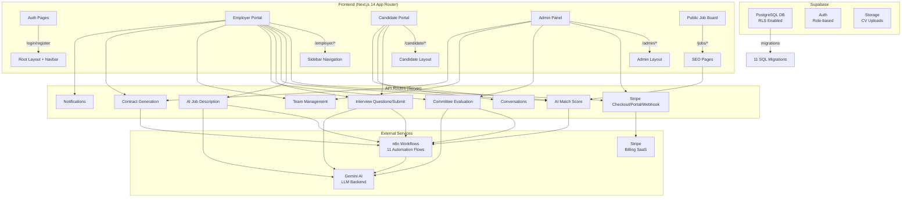

Here is a comprehensive analysis of the GrowthNexus project architecture, what has been completed, and what remains.

---

# 🏗️ GrowthNexus — Full Architecture & Status Report

---

## 1. Architecture Overview

GrowthNexus is a **Next.js 14 (App Router) + Supabase B2B SaaS** platform for smart recruitment in the UAE. It follows a **multi-tenant, role-based** architecture with three user personas:

| Persona | Role | Access Scope |
|---------|------|-------------|
| **Employer** | `employer` | Dashboard, Jobs, Applicants, Team, Analytics, Emiratisation, Settings |
| **Candidate** | `candidate` | Dashboard, Jobs, Applications, CV, Interview, Messages |
| **Admin** | `admin` | Full platform control — Users, Companies, Jobs, Transactions, Config |

### Tech Stack
- **Frontend:** Next.js 14 (App Router), React 18, Tailwind CSS, shadcn/ui, Radix UI
- **Auth:** Supabase Auth (email/password, role-based)
- **Database:** Supabase PostgreSQL with RLS (Row Level Security)
- **API Layer:** Next.js Server Actions + Route Handlers (Edge Runtime)
- **AI/Automation:** n8n webhooks (11 workflows) + mock fallbacks
- **Payments:** Stripe (subscriptions + one-time payments)
- **i18n:** Arabic-first (RTL), English support planned via `next-intl`

---

## 2. File Structure (Key Modules)

```
growth-nexus/src/app/
├── (auth)/                    # Auth pages (login, register)
│   ├── login/page.tsx
│   ├── register/page.tsx
│   └── layout.tsx             # Auth card layout
├── employer/                  # Employer portal
│   ├── layout.tsx             # Employer sidebar nav
│   ├── dashboard/page.tsx     # KPI stats, job performance
│   ├── jobs/
│   │   ├── page.tsx           # Job list with filters
│   │   ├── new/page.tsx       # 3-step job wizard (AI assist)
│   │   └── [id]/
│   │       └── applicants/
│   │           └── page.tsx   # Applicant pipeline
│   ├── applicants/page.tsx    # All applicants
│   ├── evaluate/[id]/page.tsx # Committee evaluation
│   ├── analytics/page.tsx     # KPI + rejection analytics
│   ├── emiratisation/page.tsx # MOHRE compliance gauge
│   ├── messages/page.tsx      # In-app messaging
│   ├── saved-candidates/page.tsx
│   ├── landing-pages/         # Landing page builder
│   └── settings/page.tsx      # Company settings + billing
├── candidate/                 # Candidate portal
│   ├── layout.tsx
│   ├── dashboard/page.tsx     # Profile completion, recommendations
│   ├── applications/page.tsx  # Application tracking
│   ├── cv/page.tsx            # CV upload (with n8n OCR parsing)
│   ├── interview/[id]/page.tsx # AI interview wizard
│   ├── messages/page.tsx
│   ├── saved-jobs/page.tsx
│   └── profile/page.tsx
├── admin/                     # Admin panel
│   ├── layout.tsx
│   ├── dashboard/page.tsx     # Platform KPIs
│   ├── users/page.tsx         # User management
│   ├── companies/page.tsx     # Company verification
│   ├── jobs/page.tsx          # Job moderation
│   ├── transactions/page.tsx  # Payment tracking
│   └── config/page.tsx        # System config CRUD
├── jobs/                      # Public job board
│   ├── page.tsx               # Homepage with job search
│   └── [slug]/page.tsx        # SEO job detail pages
├── apply/[token]/page.tsx     # Private apply link
├── pricing/page.tsx           # Subscription plans
├── companies/page.tsx         # Company directory
├── company/[slug]/page.tsx    # Company public page
├── payment/
│   ├── success/page.tsx
│   └── cancel/page.tsx
├── globals.css
└── layout.tsx                 # Root layout (Navbar + Toaster)
```

### API Routes (11 endpoints)

```
src/app/api/
├── stripe/checkout/route.ts       # Stripe Checkout Session
├── stripe/webhook/route.ts        # Stripe lifecycle events
├── stripe/portal/route.ts         # Billing Portal
├── ai/job-description/route.ts    # AI job description (n8n)
├── ai/match-score/route.ts        # Candidate-job matching (n8n)
├── interview/questions/route.ts   # AI interview questions (n8n)
├── interview/submit/route.ts      # Submit answers + AI scoring
├── evaluation/submit/route.ts     # Committee scorecard + auto-summary
├── team/route.ts                  # Team CRUD (invite/remove members)
├── conversations/start/route.ts   # Create messaging conversations
├── contracts/generate/route.ts    # MOHRE contract generation (n8n)
├── notifications/route.ts         # In-app notifications CRUD
└── notifications/application-notify/route.ts  # New application alerts
```

---

## 3. Database Schema (Migrations Applied)

| Migration | Status | What It Does |
|-----------|--------|-------------|
| `001_uae_schema_fixes.sql` | ✅ Done | UAE candidate fields, saved_jobs/saved_candidates tables, AED currency, match score function, profile views |
| `002_messaging_system.sql` | ✅ Done | Conversations + messages tables |
| `004_applicants_count_trigger.sql` | ✅ Done | Auto-count applicants on jobs |
| `20260224233000_landing_page_rpcs.sql` | ✅ Done | Landing page CRUD functions |
| `20260314222000_messaging_unread_triggers.sql` | ✅ Done | Unread message tracking |
| `20260422000000_phase5_enhancements.sql` | ✅ Done | `paused` job status, `offer` app status, company_type enum, rejection_reasons, nationality_requirements, public_jobs_view update |
| `20260422100000_phase8_stripe_interview_committee.sql` | ✅ Done | Stripe columns, interview_score/report, committee_evaluations table, job views function |
| `20260429000000_phase9_contract_automation.sql` | ✅ Done | contract_templates table + MOHRE default template |
| `20260429010000_save_interview_rpc.sql` | ✅ Done | save_interview_result RPC |
| `20260429020000_company_team_members.sql` | ✅ Done | company_members table, RLS, get_user_company function |
| `20260429030000_notifications_system.sql` | ✅ Done | notifications table, RLS, create_notification function |

---

## 4. ✅ What Has Been Done (Completed Features)

### Phase 1–4: Foundation
- [x] **Auth system** — Login/Register with role-based redirects (`/src/app/(auth)/`)
- [x] **Supabase client/server** — SSR-safe client (`/src/utils/supabase/`)
- [x] **Middleware** — Route protection, role-based access control, auto-profile creation, auto-company creation (`/src/utils/supabase/middleware.ts`)
- [x] **Root layout** — Navbar, RTL support, Toaster (`/src/app/layout.tsx`)
- [x] **Employer dashboard** — KPI cards (6 metrics), job performance table, smart candidate suggestions (`/src/app/employer/dashboard/page.tsx`)
- [x] **Candidate dashboard** — Profile completion widget, recent applications, recommended jobs, visibility toggle (`/src/app/candidate/dashboard/page.tsx`)

### Phase 5: ATS Pipeline & Job Enhancements
- [x] **Job posting wizard** — 3-step form with UAE cities dropdown, nationality multi-select, skills tags, AI assist button, AED currency (`/src/app/employer/jobs/new/page.tsx`)
- [x] **Job management** — Status filter tabs (All/Active/Paused/Draft/Closed), sorting, Pause/Resume, Duplicate, Share, expiry display
- [x] **Application pipeline** — Status dropdown with 7 states (applied → hired), rejection confirmation modal with reason capture, search bar, AI match score display
- [x] **Analytics dashboard** — KPI cards + rejection breakdown (`/employer/analytics`)
- [x] **Emiratisation tracker** — Gauge, stats, MOHRE compliance alert (`/employer/emiratisation`)

### Phase 6: Admin Panel
- [x] **Admin layout** with `role === 'admin'` guard
- [x] **Admin dashboard** — KPI cards (users, companies, jobs, applications, transactions)
- [x] **System config** — CRUD with inline editing, grouped by category
- [x] **Users management** — Search, role filter, inline role change
- [x] **Companies management** — Verify/reject, company type dropdown
- [x] **Jobs moderation** — Force-close, feature/unfeature, status filters
- [x] **Transactions viewer** — All payments + total revenue

### Phase 7: n8n Integration
- [x] **11 n8n workflows documented** (CV Parser, Match Score, App Notification, Smart Matching, Message Notification, Payment Verification, AI Job Description, Company Verification, Interview AI Eval, Committee Summary, Contract Generation)
- [x] **`/api/ai/job-description`** — Calls n8n webhook → Gemini, falls back to mock
- [x] **`/api/ai/match-score`** — Sends candidate+job data to n8n for scoring

### Phase 8: Stripe + Interview AI + Committee Evaluation
- [x] **Stripe Checkout** — `/api/stripe/checkout` with 3 tiers (Starter/Growth/Pro), monthly/yearly
- [x] **Stripe Webhook** — Handles checkout complete, invoice paid, subscription updated/deleted
- [x] **Stripe Portal** — Self-service billing management
- [x] **Pricing page** — Features visible, prices hidden until checkout
- [x] **Interview AI** — `/api/interview/questions` (n8n/mock), `/api/interview/submit` (AI scoring + DB save)
- [x] **Interview wizard** — Step-by-step UI at `/candidate/interview/[applicationId]`
- [x] **Committee evaluation** — `/api/evaluation/submit` with scorecard, auto-aggregation when ≥2 evaluators, outlier detection
- [x] **Evaluation UI** — Criteria sliders + notes at `/employer/evaluate/[applicationId]`

### Additional Completed Features
- [x] **Team management** — Invite/remove members, 4 roles (owner/admin/member/viewer), role-based permissions (`/src/utils/team.ts`, `/api/team/route.ts`)
- [x] **Notifications system** — In-app notifications for new applications, mark as read, bulk operations (`/api/notifications/route.ts`)
- [x] **Messaging** — Conversation creation at `/api/conversations/start/route.ts`
- [x] **Contract generation** — `/api/contracts/generate/route.ts` with MOHRE template, n8n integration
- [x] **UI Component library** — 20+ shadcn/ui components (button, card, dialog, dropdown-menu, form, input, select, table, tabs, etc.)
- [x] **Employer components** — ApplicantCard, ApplicantsList, JobsList, LandingPagesList, NotificationBell
- [x] **Candidate components** — ApplyButton, ApplyModal, PrivateApplyForm
- [x] **Type system** — Full TypeScript interfaces for all DB entities (`/src/lib/types.ts`)

---

## 5. ⏳ What Still Needs to Be Done

### Phase 9: Contract Automation & Forecasting
| Feature | Status | Details |
|---------|--------|---------|
| **Contract Template Manager UI** | ❌ Not started | Interface for admin/employer to create/edit contract templates |
| **Contract status tracking** | ❌ Not started | Sent → Viewed → Signed → Declined → Expired state machine |
| **E-sign integration** | ❌ Not started | Integration with e-signature provider (e.g., DocuSign) |
| **Forecasting Engine** | ❌ Not started | AI predictions for time-to-fill, offer acceptance, hiring difficulty |
| **Forecasting UI** | ❌ Not started | Dashboard widget showing AI predictions on `/employer/analytics` |

### Phase 10: Company Verification, B2C Services & Launch Polish
| Feature | Status | Details |
|---------|--------|---------|
| **Trade License upload** | ❌ Not started | Registration flow asks for license if using gmail/yahoo |
| **OCR verification (Workflow 8)** | ❌ n8n workflow not yet connected | Backend endpoint exists but n8n workflow needs setup |
| **Trust Score system** | ❌ Not started | Score companies based on verified documents |
| **CV Builder** | ❌ Not started | Candidate tool to build/edit CV from scratch |
| **CV Analyzer (paid)** | ❌ Not started | AI-powered CV review with Stripe one-time payment |
| **Career Path Generator** | ❌ Not started | AI tool suggesting career trajectories |
| **Job Alerts** | ❌ Not started | Email/push notifications for matching jobs |
| **`next-intl` integration** | ❌ Not started | Full EN/AR language toggle, dynamic translations |
| **SEO optimization** | ❌ Not started | Dynamic metadata, sitemap, OG images, structured data |
| **End-to-end tests** | ❌ Not started | Playwright/Cypress test suite |

### Critical Tests (from `CRITICAL_TESTS.md`)
All 11 test scenarios are defined but **none have been executed yet** (all checkboxes are `⬜`):
1. Migration verification
2. Team page appearance
3. Invite — email NOT registered
4. Invite — employer email (normal case)
5. Invite — candidate email (warning case)
6. Invite — duplicate email
7. Remove member
8. Cannot remove owner
9. Re-invite removed member
10. Role permissions (viewer restrictions)
11. Existing employer pages regression

### n8n Workflows Still Needing Connection
| Workflow | Status |
|----------|--------|
| Workflow 8: Company Verification | ❌ Endpoint exists, n8n webhook not wired |
| Workflow 11: Contract Generation | ❌ Endpoint exists, n8n webhook not wired |
| All workflows | Need live n8n instance with proper webhook URLs in `.env` |

---

## 6. Architecture Diagram



---

## 7. Summary

| Category | Completed | Remaining |
|----------|-----------|-----------|
| **Database Migrations** | 11/11 | 0 |
| **API Routes** | 12/12 | 0 (but n8n webhooks not connected) |
| **Frontend Pages** | ~30+ pages | Contract manager, forecasting, B2C services |
| **UI Components** | 20+ components | Additional components needed for remaining features |
| **n8n Workflows** | 6 connected (mock fallback) | 5 need live n8n connection |
| **Stripe Integration** | Full checkout + webhook + portal | Production webhook signature verification |
| **i18n/SEO** | Arabic RTL only | `next-intl`, sitemap, OG images |
| **Testing** | CRITICAL_TESTS.md defined | 0/11 tests executed |
| **Auth/Middleware** | Full role-based RBAC | — |

**Bottom line:** The core platform (~80%) is built and functional — auth, dashboards, ATS pipeline, Stripe billing, AI interviews, committee evaluation, team management, and notifications are all working. The remaining ~20% focuses on **contract automation**, **forecasting AI**, **B2C candidate services**, **i18n/SEO polish**, **n8n workflow wiring**, and **test execution**.